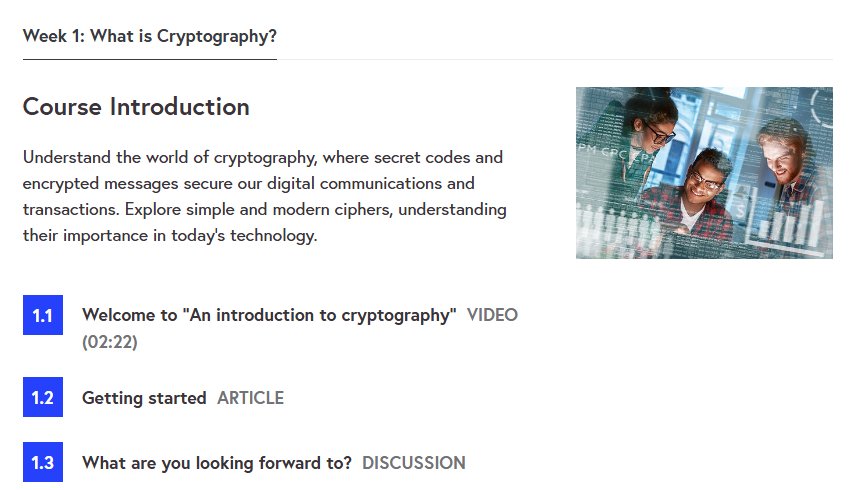
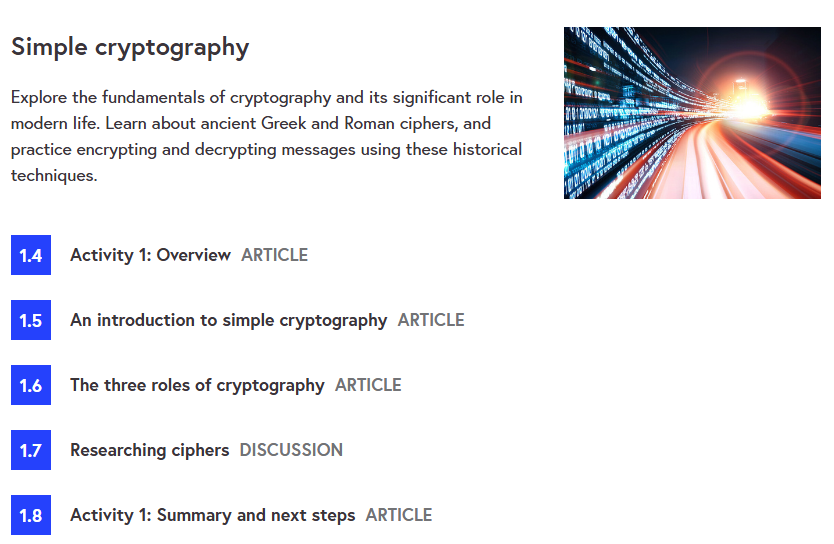
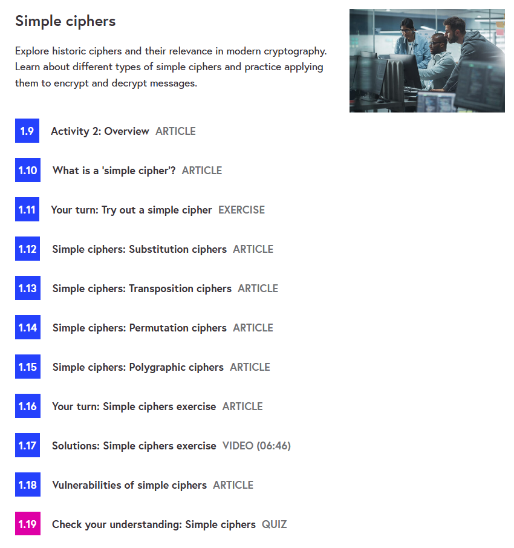
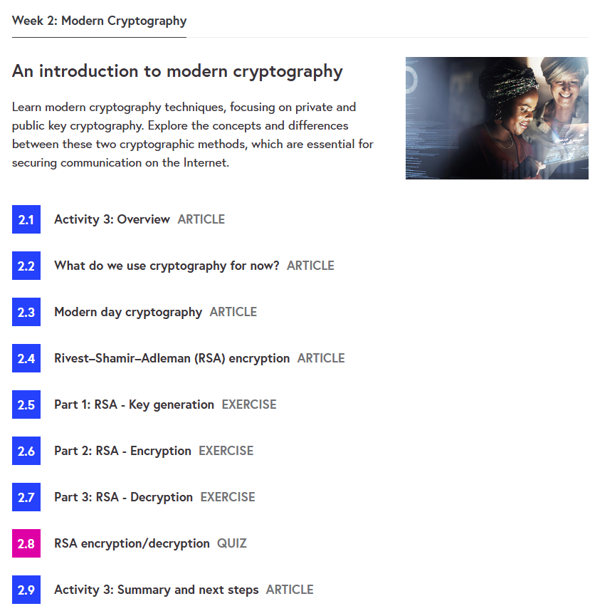
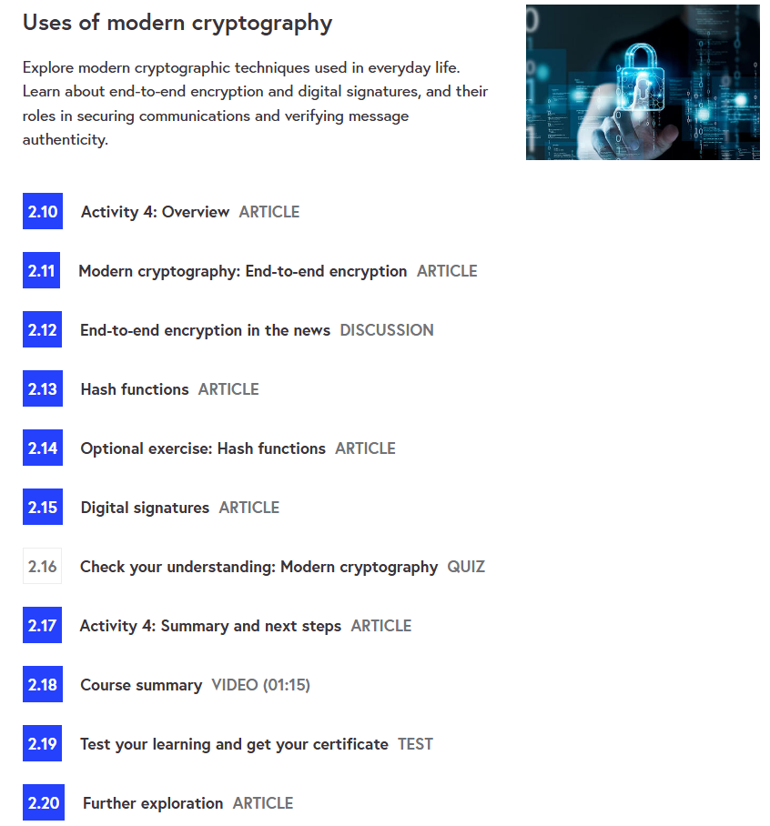

# 🔐 An Introduction to Cryptography – University of Leeds & Click Start

This repository contains **notes, labs, cheatsheets, case studies, resources, and a certificate of completion** for the  
*An Introduction to Cryptography* course by **University of Leeds & Click Start** on *FutureLearn*.  
The program covers **symmetric and asymmetric encryption, hashing, digital signatures, cryptographic protocols, attacks, and real-world applications**.

---

## 📚 Notes
- 📄 [01-introduction.md](./notes/01-introduction.md) – Introduction to cryptography  
- 📄 [02-symmetric-encryption.md](./notes/02-symmetric-encryption.md) – Symmetric key cryptography  
- 📄 [03-asymmetric-encryption.md](./notes/03-asymmetric-encryption.md) – Public key cryptography  
- 📄 [04-hashing-and-signatures.md](./notes/04-hashing-and-signatures.md) – Hashing & digital signatures  
- 📄 [05-cryptographic-protocols.md](./notes/05-cryptographic-protocols.md) – Secure protocols  
- 📄 [06-cryptographic-attacks.md](./notes/06-cryptographic-attacks.md) – Common attacks on crypto  
- 📄 [07-real-world-applications.md](./notes/07-real-world-applications.md) – Applications in practice  

---

## 🧪 Labs
- 🔧 [symmetric-encryption-lab.md](./labs/symmetric-encryption-lab.md) – Hands-on with symmetric ciphers  
- 🔧 [rsa-encryption-lab.md](./labs/rsa-encryption-lab.md) – RSA key pair generation & encryption  
- 🔧 [hashing-lab.md](./labs/hashing-lab.md) – Hash functions & integrity checks  
- 🔧 [digital-signature-lab.md](./labs/digital-signature-lab.md) – Digital signatures  

---

## 📋 Cheatsheets
- 📘 [symmetric-vs-asymmetric.md](./cheatsheets/symmetric-vs-asymmetric.md) – Key differences  
- 📘 [common-algorithms.md](./cheatsheets/common-algorithms.md) – RSA, AES, DES, ECC, SHA  
- 📘 [applications.md](./cheatsheets/applications.md) – Cryptography in the real world  
- 📘 [attacks-on-crypto.md](./cheatsheets/attacks-on-crypto.md) – Brute force, side-channel, chosen-plaintext  
- 📘 [best-practices.md](./cheatsheets/best-practices.md) – Security recommendations  

---

## 🔬 Extras
- 📑 [case-studies.md](./extras/case-studies.md) – Famous cryptography use cases  
- 📑 [resources.md](./extras/resources.md) – Useful books & links  
- 📆 [timeline.md](./extras/timeline.md) – Historical timeline of cryptography  

---

## 📖 Docs
- 📘 [index.md](./docs/index.md) – Course overview  
- 📘 [glossary.md](./docs/glossary.md) – Cryptography terminology  
- 📘 [references.md](./docs/references.md) – References & citations  
- 📘 [roadmap.md](./docs/roadmap.md) – Learning roadmap  
- 📘 [syllabus.md](./docs/syllabus.md) – Course syllabus  

---

## 📸 Screenshots

| Step | Screenshot |
|------|------------|
| 📚 Week 1 – Intro |  |
| 🔑 Week 1 – Symmetric |  |
| 🔐 Week 1 – Asymmetric |  |
| 📝 Week 2 – Hashing |  |
| ✅ Week 2 – Applications |  |

---

## 📜 Certificate
🎓 [Certificate of Achievement – An Introduction to Cryptography](./cert/an-intro-to-cryptography_certificate_of_achievement_fifimkb.pdf)  

---

## 📝 Personal Review
This course provided me with a **practical foundation in cryptography**,  
from **understanding symmetric/asymmetric algorithms** to **real-world applications in security protocols**.  
The **labs and cheatsheets** were especially useful for **hands-on practice** and **quick revision**.

---

## ✍️ Author
**Thành Danh** – Red Team Learner & Security Researcher  

- GitHub: [@ngvuthdanhh](https://github.com/ngvuthdanhh)  
- Email: ngvu.thdanh@gmail.com  

---

## 📄 License
This project is licensed under the terms of the **MIT License**. See [LICENSE](./LICENSE) for full details.  
© 2025 ngvuthdanhh. All rights reserved.  
